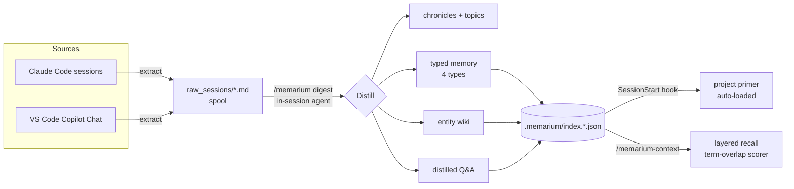
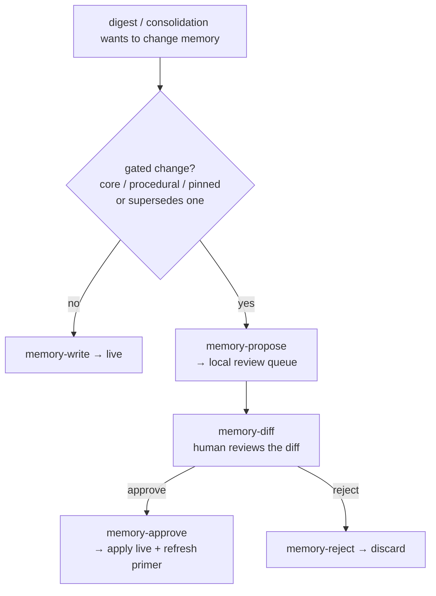

# memarium — a local, auditable **Memory OS** for AI coding agents

[English](#english) · [中文](#中文)

**📖 Project page:** https://june9593.github.io/memarium-plugin/ · **npm CLI (optional sync):** https://github.com/june9593/memarium

> memarium turns your AI coding sessions into a **durable, typed, queryable memory** that every future session starts from — not just a log of what happened, but a layered *Memory OS*: typed memory, an entity wiki, distilled Q&A, health linting, a human-review gate for long-term memory, and a CI scorer regression eval harness.
>
> **Markdown-first. Local. Git-syncable. Fully auditable.** No cloud, no vector database, and **no LLM in the storage/retrieval layer** — all writing happens in-session via skills; the CLI is pure I/O.

---

## Architecture at a glance

**Digest → memory → recall** (how a session becomes context the next session starts with):



**The memory-PR gate** (v4 self-evolution — long-term memory cannot change without review):



---

## English

### What it is

A Claude Code plugin that gives an AI coding agent **long-term memory it can trust**. Run `/memarium` to digest your sessions into per-project chronicles **and** a typed memory store; a SessionStart hook then auto-loads a compact *primer* so every new session begins already knowing the project's rules, setup, facts, and gotchas — instead of re-deriving them every time.

Self-contained: no extra CLI required, no cloud service, your data stays local and human-readable.

### The Memory OS (built in layers)

| Layer | What it adds |
|---|---|
| **v1 — typed memory** | Four memory types (`core` / `semantic` / `episodic` / `procedural`), a per-project **primer**, a JSON index, and a relevance scorer. |
| **v2 — primer + entities** | A **SessionStart hook** that auto-injects the primer; an **entity wiki** (one living page per file / symbol / API / concept / person). |
| **qa — distilled Q&A** | A `qa/` answer layer: durable question→answer pairs (compound questions, troubleshooting conclusions, decision rationale, operational routes). |
| **v3 — lint + consolidation** | `memory-lint`, a read-only health check (expired / dangling-supersede / duplicate-like / missing-provenance / stale), plus a conservative consolidation step at digest time. |
| **v4 — self-evolution gate** | A **"memory-PR"** flow: changes to long-term `core` / `procedural` / pinned memory can't be written directly — the agent must `memory-propose`; a human reviews with `memory-diff` and applies with `memory-approve` (or `memory-reject`). One bad summary can't silently poison long-term behavior. |
| **v5 — retrieval eval** | A deterministic, LLM-free **scorer regression suite** (LongMemEval-style fixtures) that locks the scorer's behavior against a hand-authored corpus in CI — a guardrail against scorer regressions, *not* a held-out recall benchmark — with zero runtime footprint. (Real-corpus recall measurement is a separate, ongoing effort.) |

### Why it's designed this way — prior art & lineage

memarium is deliberately grounded in published research and a clear set of trade-offs, not invented from scratch:

| Design choice | Based on / informed by | Why |
|---|---|---|
| **Typed memory** (core / semantic / episodic / procedural) | **CoALA** — *Cognitive Architectures for Language Agents* (Sumers, Yao, Narasimhan, Griffiths, 2023) | A principled memory taxonomy from cognitive science, rather than one undifferentiated blob. |
| **Relevance scorer** = recency + importance + relevance | **Generative Agents** (Park et al., 2023) — the memory-stream retrieval function | A simple, explainable, well-validated ranking signal. |
| **Scorer regression eval** | **LongMemEval** (Wu et al., 2024) — long-term memory benchmark for chat assistants | Inspiration for the ability axes (info-extraction, multi-session, temporal, knowledge-update, abstention), which are exercised against a fixture corpus to catch scorer regressions — not a benchmark of real-corpus recall. |
| **Markdown-first, local, git-synced, no vector DB** | A deliberate counter-position to vector/graph memory stacks like **mem0**, **Letta / MemGPT**, **Zep / Graphiti**, **A-MEM** | Auditability and ownership: memory is human-readable, diff-able, and version-controlled. The cost — lexical (term-overlap) retrieval — is a known trade-off (see [Limitations](#limitations--roadmap)). |
| **Memory-PR governance gate** | (novel) — most memory frameworks let the agent self-edit long-term memory freely | Governance: long-term, behavior-shaping memory changes get human review before they persist. |
| **Entity wiki + distilled Q&A** | Personal-knowledge-base / Zettelkasten practice (linked atomic notes) | A reverse-index synthesis layer on top of episodic chronicles. |

> **Honest positioning:** the taxonomy, scorer, and governance gate are aligned with — and in places ahead of — mainstream agent-memory tooling; the eval harness is a CI regression guard (held-out real-corpus recall benchmarking is ongoing, not yet shipped). The one intentional gap is **lexical-only retrieval** (no embeddings/graph); see the roadmap below for how we plan to close it without giving up auditability.

### Commands & skills

**Skills (slash commands — the everyday surface):**
- **`/memarium`** — digest synced sessions into per-project chronicles + topics, and author typed memory + entity wiki + distilled Q&A (with a conservative consolidation pass).
- **`/memarium-context`** — load this project's memory at the start of work: *Core rules / Procedures & gotchas / Project facts / Episodes / Conflicts / Entities / Past Q&A / Pending memory proposals.*
- **`/memarium-recall`** — three-stage progressive recall of past chronicles & topics (topic list → frontmatter → bodies).
- **SessionStart hook** — auto-injects the project primer so a new session starts informed.

**Underlying `bin/memarium-plugin.js` subcommands** (the skills call these; pure I/O, no LLM):
`memory-write` · `memory-query` · `memory-index` · `memory-primer` · `entity-write` · `entity-query` · `entity-index` · `qa-write` · `qa-query` · `qa-index` · `memory-lint` · `memory-propose` · `memory-diff` · `memory-approve` · `memory-reject` · `recall` · `catalog-regen` · `site` · `list-projects` · `status` · `prepare` · `publish`.

### Install

```text
/plugin marketplace add june9593/memarium-plugin
/plugin install memarium
```

Open any Claude Code session and run `/memarium` to digest your local sessions; a new session afterward auto-loads the project primer.

### Cross-device sync (optional)

To carry sessions **and** memory across machines, install the optional **memarium** npm CLI:

```sh
npm i -g memarium
memarium init
```

It syncs `~/.memarium/session-repo/` (sessions, chronicles, **and** the `memory/` layer) to a private GitHub repo, aggregating across devices on the `main` branch. The CLI also resumes a session on another machine:

```sh
memarium list-sessions --since 1d   # find the sessionId
memarium resume <sessionId>         # copies jsonl into ~/.claude/projects/ + prints `claude --resume <id>`
```

> **Note:** the memory layer (`memory/` + its indexes) syncs only with CLI **≥ 0.8.6**. The plugin and CLI share the same spool path; install one, both, or neither. npm CLI: https://github.com/june9593/memarium

### Files written

- `~/.memarium/session-repo/raw_sessions/<tool>/<project>/<date>/*.md` — rendered session (single `.md`: YAML frontmatter w/ `manifest_version: 1` + `tools_used` / `commits` / `files_touched`, a Table-of-Contents block, then the body).
- `~/.memarium/session-repo/book/<project>/{chronicle,topics}/*.md` — digested book.
- `~/.memarium/session-repo/memory/{<type>,entities,qa,_primer}/...` — the Memory OS store.
- `~/.memarium/session-repo/.memarium/index.{json,book,memory,entity,qa}.json` — indexes.
- `~/.memarium/local-proposals/<repoHash>/*.json` — **local-only** memory-PR queue (never synced).

The plugin **does not** create or modify `.git/` or the npm CLI's config files — those are owned by the optional CLI.

### Limitations & roadmap

- **Lexical-only retrieval (the known gap).** Recall ranks by keyword overlap + scope + recency + importance, so a *semantically* related but *lexically* different query can under-recall. The scorer is **presence-based term-overlap, not IDF-weighted** — rare and common tokens weigh equally (IDF was evaluated and deferred as net-neutral on the current corpus). Planned: an **optional local embedding index** used only for recall ranking (markdown stays the source of truth — never "vector-only"), validated against the v5 eval harness before adoption.
- **Codex as a third session source** — adapter in progress.
- **End-to-end answer-quality eval** (no-context vs recalled-context) — a documented follow-up to the v5 retrieval eval.

### Repo layout

- `skills/` — `/memarium`, `/memarium-context`, `/memarium-recall` skill files (in-session prompts).
- `commands/` — slash-command thin wrappers · `hooks/` — SessionStart primer + Stop nudge.
- `bin/memarium-plugin.js` — bundled CLI invoked by the skills (single esbuild output; not on PATH).
- `src/` — TypeScript source · `tests/` — vitest suite (`npm install && npx vitest run`).
- `docs/` — GitHub Pages source (product landing page).

### Contributing

PRs welcome. Open an issue first for anything beyond a typo — design changes are spec-driven and benefit from discussion. **License: MIT.**

---

## 中文

### 这是什么

一个 Claude Code 插件,给 AI 编程 agent 一套**可信赖的长期记忆**。跑 `/memarium` 把会话整理成按项目分组的 chronicle,**同时**生成一套有类型的记忆;之后 SessionStart hook 会自动加载一份精简的 *primer*,让每个新会话一开始就知道这个项目的规则、配置、事实和坑 —— 而不是每次都重新摸索。

独立运行:不需要额外 CLI、不需要云服务,数据全部留在本地、人类可读。

### Memory OS(分层构建)

| 层 | 加了什么 |
|---|---|
| **v1 — typed memory** | 四种记忆类型(`core` / `semantic` / `episodic` / `procedural`)、按项目的 **primer**、JSON 索引、相关性打分器。 |
| **v2 — primer + 实体** | **SessionStart hook** 自动注入 primer;**entity wiki**(每个文件 / 符号 / API / 概念 / 人一份活页)。 |
| **qa — 精炼问答** | `qa/` 答案层:可复用的问→答对(复合问题、排障结论、决策理由、操作路径)。 |
| **v3 — lint + 整合** | `memory-lint` 只读健康检查(过期 / 悬挂 supersede / 疑似重复 / 缺出处 / 陈旧),以及 digest 时的保守整合。 |
| **v4 — 自进化门禁** | **"memory-PR"** 流程:长期 `core` / `procedural` / pinned 记忆不能直接写 —— agent 必须 `memory-propose`;人用 `memory-diff` 审、用 `memory-approve` 落库(或 `memory-reject`)。一条坏 summary 无法静默污染长期行为。 |
| **v5 — 召回评估** | 确定性、不调 LLM 的 **scorer 回归套件**(LongMemEval 风格的 fixture),在 CI 里把 scorer 行为锁在一组手写语料上 —— 是防 scorer 回归的护栏,**不是** held-out 召回基准,零运行时开销。(真实语料的召回测量是另一条单独、进行中的工作。) |

### 为什么这么设计 —— 参考的论文与 repo

memarium 刻意建立在公开研究和清晰的取舍之上,而不是凭空发明:

| 设计选择 | 参考 / 受启发于 | 为什么 |
|---|---|---|
| **typed memory**(core / semantic / episodic / procedural) | **CoALA** — *Cognitive Architectures for Language Agents*(2023) | 来自认知科学的记忆分类法,而不是一坨无差别的 blob。 |
| **打分器** = recency + importance + relevance | **Generative Agents**(Park 等, 2023)的 memory-stream 召回函数 | 简单、可解释、被验证过的排序信号。 |
| **Scorer 回归评估** | **LongMemEval**(Wu 等, 2024)长期记忆基准 | 借鉴其能力维度(信息抽取/多会话/时序/知识更新/弃答),在 fixture 语料上跑来防 scorer 回归 —— 不是真实语料召回的基准。 |
| **markdown 优先、本地、git 同步、不用向量库** | 对 **mem0**、**Letta / MemGPT**、**Zep / Graphiti**、**A-MEM** 这类向量/图记忆栈的刻意反向选择 | 可审计、可拥有:记忆人类可读、可 diff、可版本控制。代价是词法(term-overlap)召回 —— 一个已知取舍(见[局限](#局限与路线图))。 |
| **memory-PR 治理门禁** | (新)—— 多数记忆框架让 agent 自由自改长期记忆 | 治理:会长期影响行为的记忆改动落库前先经人审。 |
| **entity wiki + 精炼 Q&A** | 个人知识库 / Zettelkasten 实践(链接式原子笔记) | 在 episodic chronicle 之上的反向索引综合层。 |

> **如实定位:** 分类法、打分器、治理门禁与主流 agent 记忆工具持平,有些地方还领先;评估 harness 是 CI 回归护栏(真实语料的 held-out 召回基准还在进行、尚未上线)。唯一刻意的缺口是**纯词法召回**(没有 embedding / 图);路线图里写了如何在不放弃可审计的前提下补上它。

### 命令与 skills

**Skills(斜杠命令 —— 日常入口):**
- **`/memarium`** —— 把会话整理成 chronicle + topic,并生成 typed memory + entity wiki + 精炼 Q&A(带保守整合)。
- **`/memarium-context`** —— 工作开始时加载本项目记忆:核心规则 / 操作与坑 / 项目事实 / 片段 / 冲突 / 实体 / 历史 Q&A / 待审记忆提案。
- **`/memarium-recall`** —— 三阶段渐进召回历史 chronicle 与 topic(topic 列表 → frontmatter → 正文)。
- **SessionStart hook** —— 自动注入项目 primer,新会话一开始就有底。

**底层 `bin/memarium-plugin.js` 子命令**(skills 调用;纯 I/O,不调 LLM):
`memory-write` · `memory-query` · `memory-index` · `memory-primer` · `entity-write` · `entity-query` · `entity-index` · `qa-write` · `qa-query` · `qa-index` · `memory-lint` · `memory-propose` · `memory-diff` · `memory-approve` · `memory-reject` · `recall` · `catalog-regen` · `site` · `list-projects` · `status` · `prepare` · `publish`。

### 安装

```text
/plugin marketplace add june9593/memarium-plugin
/plugin install memarium
```

开任何 Claude Code 会话跑 `/memarium` 整理本机会话;之后新会话会自动加载项目 primer。

### 跨设备同步(可选)

要把会话**和记忆**带到多台机器,装可选的 **memarium** npm CLI:

```sh
npm i -g memarium
memarium init
```

它把 `~/.memarium/session-repo/`(会话、chronicle、**以及** `memory/` 层)同步到私有 GitHub repo,并在 `main` 分支跨设备聚合。CLI 也能在另一台机器 resume 会话:

```sh
memarium list-sessions --since 1d
memarium resume <sessionId>
```

> **注意:** 记忆层(`memory/` 及其索引)只在 CLI **≥ 0.8.6** 时同步。插件与 CLI 共享同一 spool 路径;装一个、两个、或都不装都行。npm CLI:https://github.com/june9593/memarium

### 写到哪里

- `~/.memarium/session-repo/raw_sessions/<tool>/<project>/<date>/*.md` —— 渲染过的会话(单 `.md`:YAML frontmatter + 目录块 + 正文)。
- `~/.memarium/session-repo/book/<project>/{chronicle,topics}/*.md` —— 整理出的笔记本。
- `~/.memarium/session-repo/memory/{<type>,entities,qa,_primer}/...` —— Memory OS 存储。
- `~/.memarium/session-repo/.memarium/index.{json,book,memory,entity,qa}.json` —— 索引。
- `~/.memarium/local-proposals/<repoHash>/*.json` —— **仅本地**的 memory-PR 队列(从不同步)。

插件**不会**创建或修改 `.git/` 或 npm CLI 的配置文件 —— 那些归可选 CLI 管。

### 局限与路线图

- **纯词法召回(已知缺口)。** 召回靠关键词重叠 + scope + recency + importance 排序,所以语义相关但词面不同的查询可能漏召回。打分是**基于出现的 term-overlap,不是 IDF 加权** —— 稀有词和泛词同权(IDF 评估过,在当前语料上净收益为零,已搁置)。计划:加一个**可选的本地 embedding 索引**,只用于召回排序(markdown 仍是唯一真相源,绝不"纯向量"),上线前用 v5 eval harness 实测验证。
- **Codex 作为第三个会话源** —— adapter 进行中。
- **端到端答案质量评估**(无上下文 vs 召回上下文)—— v5 召回评估之后的后续项。

### 仓库布局

- `skills/` —— `/memarium`、`/memarium-context`、`/memarium-recall` 的 skill 文件。
- `commands/` —— slash 命令薄壳 · `hooks/` —— SessionStart primer + Stop 提醒。
- `bin/memarium-plugin.js` —— skill 调用的打包 CLI(单 esbuild 输出;不进 PATH)。
- `src/` —— TypeScript 源 · `tests/` —— vitest(`npm install && npx vitest run`)。
- `docs/` —— GitHub Pages 源(产品落地页)。

### 贡献

欢迎 PR。typo 之外的改动先开 issue 讨论 —— 设计层改动是 spec 驱动的。**许可证:MIT。**
