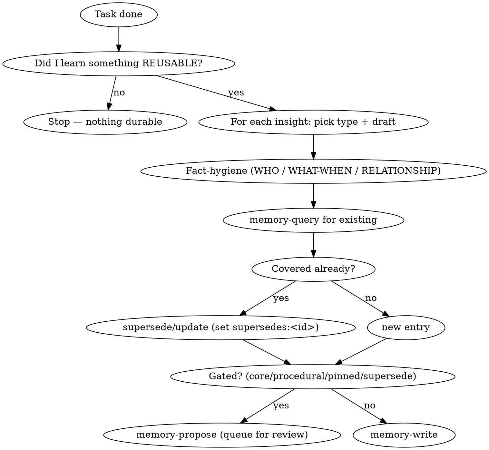

# memarium retro — in-session memory capture

After completing a task, distill what you learned into memarium's **typed
memory** so the next session (on this or another device) starts already knowing
it. This is the *live, proactive* path: one insight from the CURRENT
conversation, captured now — not the batch `/memarium` digest (which reads
already-synced sessions and also writes chronicles). Both coexist; dedup keeps
them from doubling up.

## Resolve the plugin CLI once

```bash
VBP="${CLAUDE_PLUGIN_ROOT:+$CLAUDE_PLUGIN_ROOT/bin/memarium-plugin.js}"
[ -x "$VBP" ] || VBP=$(ls -d ~/.claude/plugins/cache/*/memarium/*/bin/memarium-plugin.js 2>/dev/null | sort -V | tail -1)
[ -x "$VBP" ] && "$VBP" --version   # sanity check (silent no-op if unresolved)
```

If `$VBP` doesn't resolve, the plugin isn't installed — stop silently (don't block the turn).

## Process



1. **Ask: did THIS session produce something reusable?** A gotcha, a decision, a
   fact about the project, a how-to. If it was purely informational / trivial, or
   you already captured it, **stop — write nothing**. Not every session earns a memory.

2. **Pick the type** (`id` = `<type>/<project|_global>/<kebab-slug>`):
   - **semantic** — a durably-true project fact / architecture / decision.
   - **procedural** — a how-to playbook or gotcha ("to add X do Y, watch out for Z").
   - **episodic** — a lightweight pointer to what happened this session (title + summary + `sourceSessions`).
   - **core** — a never-forget rule (rare). scope `global`/`user`/`project:<slug>`.

3. **Fact-hygiene check** — before writing, scan the draft for implicit context a
   stranger (or future AI) couldn't decode. One sentence of context prevents a
   hallucinated narrative later:
   - **WHO** — every project/product/team named: is it the user's own work or external? Would a zero-context reader know?
   - **WHAT-WHEN** — every number (days/tokens/cost/version): is it bound to a specific project + time?
   - **RELATIONSHIP** — words like "对标 / 参照 / 基于 / reference": spell out the actual relationship (authored / benchmarked against / forked from / inspired by).

4. **Dedup** — before writing, search existing memory (decision A: retro and the
   batch digest coexist by dedup):
   ```bash
   "$VBP" memory-query --cwd "$(pwd)" --q "<keywords from the insight>"
   ```
   If an entry already covers it, either skip, or write an updated entry that sets
   `supersedes: <old-id>` (if the old entry is **core/procedural/pinned**, that
   supersede is a gated change — see step 6; superseding a plain semantic/episodic
   entry is not gated and goes through `memory-write`).

5. **Set the fields** (same shape as the batch digest's `{ entry, body }`):
   - **`trust` on every `semantic`** (`trusted` | `untrusted` | `unknown`): `trusted`
     only when the fact is from the user's OWN work on THIS project (this session /
     a commit in this repo / a verified local fact) — only `trusted` semantic
     auto-injects into the SessionStart primer. External / cross-project / unverified
     → `untrusted`. **Default `untrusted` when in doubt.**
   - `entities` = file paths / symbols / APIs the memory is about (powers recall).
   - `importance` 0–5, `confidence` 0–1. **Do NOT set `accessCount`** (device-local, auto-maintained).
   - Provenance: set `sourceSessions` to the current session id if you know it; else leave `[]` (the batch digest fills it later).

6. **Write — respecting the v4 gate.** Split items into two arrays:
   - **Non-gated** (`semantic`, `episodic`) → `/tmp/memarium-retro.json`, then:
     ```bash
     "$VBP" memory-write --input /tmp/memarium-retro.json
     ```
   - **Gated** (`core`, `procedural`, `status: pinned`, OR anything that supersedes/edits a core/procedural/pinned entry, OR a trust elevation to `trusted`) → `/tmp/memarium-retro-gated.json` (same `{ entry, body }` items, optional `rationale`/`sourceSession`), then:
     ```bash
     "$VBP" memory-propose --input /tmp/memarium-retro-gated.json
     ```
     These **queue locally for human review** — they do NOT land live. **Never approve your own proposals.** If you call `memory-write` with a gated item it errors "use memory-propose" — re-route it.

7. **Done.** The SessionStart primer renders live from the merged memory view, so
   what you wrote (or a teammate approves) shows up next session automatically —
   no refresh needed. Keep it to the ONE or few genuinely-reusable insights; this
   is a scalpel, not the batch digest.

## Notes
- This never blocks the turn. If anything fails, report briefly and move on.
- Never put real secrets / credentials / tokens / exact secret-file contents in a memory entry — use abstract or redacted descriptions.
- Language: match the user's CLAUDE.md preferences for titles/summaries.
